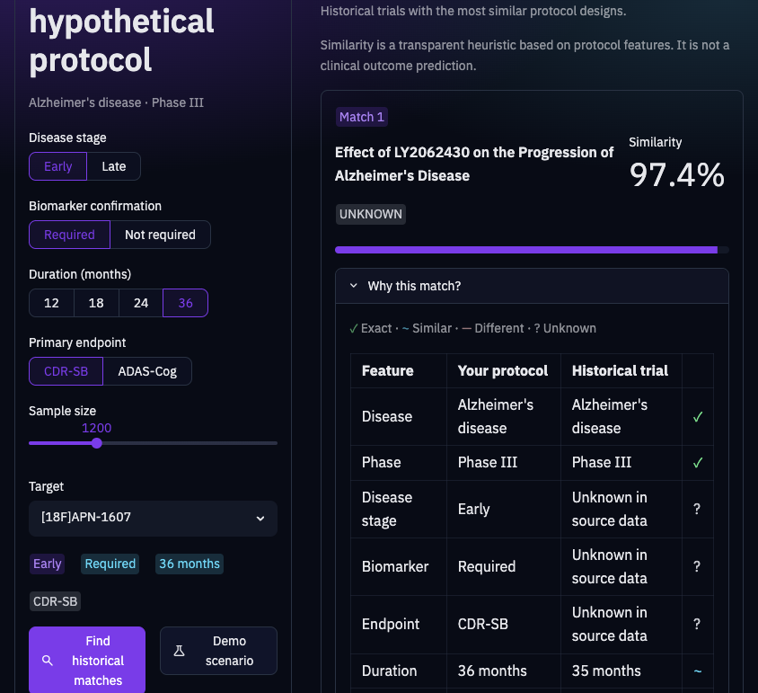
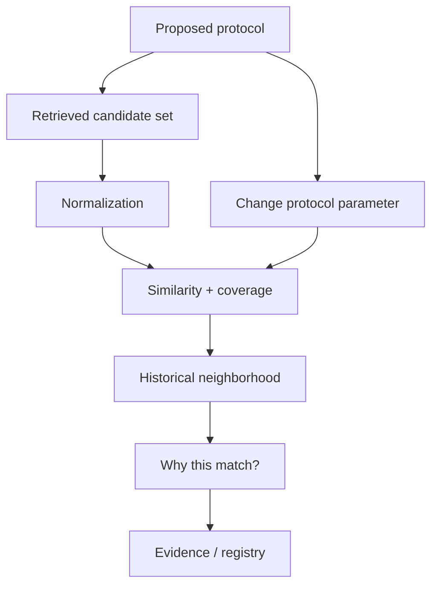

# ProtocolNeighbor

### An evidence-driven historical sandbox for clinical-trial design

🥈 **2nd Place** — AI in Life Sciences Hackathon @ DTU Skylab, Copenhagen — September 2026

> Change your protocol, and see which historical trials it starts to resemble.

ProtocolNeighbor lets a researcher define a hypothetical Alzheimer's Phase III protocol, compare it with historical studies, see which protocol characteristics are comparable, and explore how the historical neighborhood changes when one design parameter changes.

<p align="center">
  <a href="https://amedeone03-amass-trialcore-demo-app-yxl5za.streamlit.app/">
    
  </a>
</p>

A demo GIF is not in this repository yet. Capture steps: [`docs/DEMO_GIF.md`](docs/DEMO_GIF.md).

The screenshots below were captured before the ProtocolNeighbor rebrand (previous public name: TrialTwin). Treat them as layout references, not current chrome.

<p align="center">
  
</p>

Live app: [ProtocolNeighbor on Streamlit](https://amedeone03-amass-trialcore-demo-app-yxl5za.streamlit.app/)

---

## The problem

Clinical-trial design often requires researchers to benchmark a proposed protocol against historical studies: intervention, population, endpoint, duration, biomarker strategy, and sample size.

ProtocolNeighbor turns that historical comparison into an interactive sandbox. Historical similarity means **resemblance only**.

---

## How it works

1. Design a hypothetical protocol (Alzheimer's disease · Phase III, plus stage, biomarker, duration, endpoint, sample size, intervention).
2. Retrieve a capped set of historical TrialCore records, or load synthetic demonstration records.
3. Normalize records without inventing missing clinical values.
4. Compute historical similarity among **available comparable fields**.
5. Report **comparison coverage** for how much of the intended model had usable data.
6. Rank neighbors inside the retrieved candidate set.
7. Explain matches feature by feature, with registry provenance.
8. Change one protocol parameter and watch the neighborhood move.



Alzheimer's disease and Phase III define the candidate pool; they are not part of the similarity score.

Similarity compares available protocol design features. Coverage tells you how much comparable data was actually available. Details: [`docs/SCORING.md`](docs/SCORING.md).

---

## Scientific scope

ProtocolNeighbor is a research/hackathon prototype.

It provides historical protocol similarity, coverage, and evidence traceability.

It does not predict trial success or failure, estimate a probability of success, recommend a protocol, optimize a design, or perform causal inference.

Live TrialCore mode currently does not classify trial success/failure. Outcome is not inferred from `COMPLETED`, `TERMINATED`, `WITHDRAWN`, `hasResults`, or `whyStopped`.

---

## Candidate retrieval

TrialCore **search does not document offset or cursor pagination**. Each search request returns at most 300 records via `limit` (documented range 1–300).

ProtocolNeighbor requests a single capped page (default **100**, configurable with `PROTOCOL_NEIGHBOR_CANDIDATE_LIMIT`, maximum 300). Ranking is among those retrieved Phase III Alzheimer candidates, not an exhaustive corpus search.

---

## Quick start

```bash
git clone https://github.com/amedeone03/amass-trialcore-demo.git
cd amass-trialcore-demo

python3 -m venv .venv
source .venv/bin/activate   # Windows: .venv\Scripts\activate

pip install -r requirements.txt

cp .env.example .env
# AMASS_API_KEY=your_amass_api_key_here   # optional

streamlit run app.py
```

Open http://localhost:8501. **Find historical matches** uses live TrialCore when the key works; otherwise synthetic demonstration records.

```bash
python -m unittest discover -s trialtwin/tests -v
```

---

## Data provenance

**Live mode (AMASS TRIALCORE).** Records are fetched (`Alzheimer's disease`, `PHASE3`) and normalized. Missing fields stay unknown/`None`. Protocol duration is not inferred from study start/completion dates. Those dates may appear as **study calendar span** in Evidence only. Registry `sourceUrl` is shown when Amass provides it; no fake Amass UI URL is constructed.

**Demo mode (LOCAL SYNTHETIC DATA).** If live retrieval is not requested or Amass is unavailable (expected Amass errors only), the app loads `trialtwin/data/alzheimer_trials.json`. Those records are mock/synthetic. Demo outcome labels are sandbox labels only.

The MIT license covers this repository's source code, not Amass data or third-party services.

---

## Architecture

| Piece | Role |
| --- | --- |
| Amass TrialCore | Historical clinical-trial records |
| `trialtwin` package | Normalization, similarity, ranking (internal name retained) |
| Streamlit | Interactive application |

---

## Hackathon

ProtocolNeighbor started as TrialTwin during the AI in Life Sciences Hackathon at DTU Skylab in Copenhagen in September 2026. The project placed 2nd. Built with Cursor and Amass tooling. That does not imply endorsement beyond hosting and tooling.

## Team

- Amedeo Bozzoli — [GitHub](https://github.com/amedeone03)
- Christian Deluca
- Marcos Cuervo Santos

## Roadmap

- Expand beyond Alzheimer's disease
- Validate similarity features with domain experts
- Optional DrugCore mapping from intervention to biological target
- Evaluate similarity functions empirically

## License

MIT. See [`LICENSE`](LICENSE).
