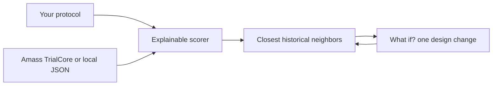

<p align="center">
  
</p>

<h1 align="center">TrialTwin</h1>

<p align="center">
  <strong>Stress-test a proposed Alzheimer's Phase III protocol against history.</strong>
</p>

<p align="center">
  <a href="https://amedeone03-amass-trialcore-demo-app-yxl5za.streamlit.app/">
    
  </a>
</p>

<p align="center">
  
  
  
</p>

<p align="center">
  <em>AI in Life Sciences</em> · DTU Skylab × Cursor × Amass · September 2026
</p>

---

## What this app is

TrialTwin is a **historical protocol sandbox**. You describe a hypothetical Alzheimer's Phase III trial. The app finds past trials whose *designs* look most like yours, then lets you change one setting and see whether that set of lookalikes changes.

It compares **protocols**, not patients and not drugs' efficacy.

**The app is saying:**  
*If you design a trial like this, these past trials look most like it.*

**When you change a parameter, it is saying:**  
*That change made your design look like a different set of past trials.*

It is **not** saying the protocol will succeed, that a drug is better, or that 95% similarity means a 95% chance of working. The number is only how alike the designs are on the fields both sides actually have.

---

## What you compare

The same design fields on your hypothetical protocol and on each historical trial:

| Field | Role |
| --- | --- |
| Disease and phase | Locked here to Alzheimer's · Phase III |
| Disease stage | Early vs late |
| Biomarker confirmation | Required or not |
| Duration | Follow-up in months |
| Primary endpoint | CDR-SB or ADAS-Cog |
| Sample size | Planned enrollment |
| Target | Intervention / target name |

Each field is **exact**, **similar** (numbers only), **different**, or **unknown**. Unknown values are left out of the score instead of being guessed.

**Why compare them?** A protocol is a bundle of choices. The only way this prototype can “test” a choice is to ask: *if I set the knobs this way, which registered or completed trials look like that bundle?* That is the neighborhood. Changing one knob is useful only if you can see the neighborhood move.

---

## How to use it

1. Open the [live demo](https://amedeone03-amass-trialcore-demo-app-yxl5za.streamlit.app/).
2. Set the knobs on the left (or click **Demo scenario**).
3. **Find historical matches** loads Alzheimer's Phase III records from [Amass TrialCore](https://amass.tech) when a key is available, otherwise a small labeled prototype set.
4. Read the top neighbors and open **Why this match?** — that table is the explanation of the percentage.
5. Change **one** control (for example duration 18 → 24 months). **What if?** shows who entered and left the top three.

<p align="center">
  
</p>

<p align="center">
  
</p>

---

## How scoring works



The scorer in `trialtwin/engine.py` is a transparent weighted checklist, not a machine-learning model and not a clinical predictor. Heavier weights sit on stage, biomarker, and endpoint; duration and sample size get partial credit when they are close.

**Live Amass limits:** TrialCore does not classify success or failure, and often has no structured disease stage or biomarker flag. Those features show as unknown and do not count. Disease and phase already match almost every row in this search, so live scores can look high even when the trials are very different drugs. The prototype JSON is synthetic and labeled only so the sandbox can show an outcome profile.

---

## Run locally

```bash
pip install -r requirements.txt
streamlit run app.py
```

Optional: copy `.env.example` to `.env` and set `AMASS_API_KEY`. Without a key, the app uses `trialtwin/data/alzheimer_trials.json`.

```bash
python -m unittest discover -s trialtwin/tests -v
```

Prototype — not medical software.
