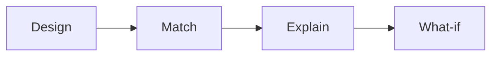

# TrialTwin

### Historical benchmarking for clinical-trial design

🥈 **2nd Place · Built in one day**  
**AI in Life Sciences Hackathon · DTU Skylab × Cursor × Amass**  
Copenhagen · September 2026

> **Change your protocol. See which historical trials it starts to resemble.**

TrialTwin is an interactive sandbox for comparing a hypothetical clinical-trial protocol with historical trial designs. It ranks the closest historical neighbors, explains what matched, and lets researchers change one protocol decision to see how the historical neighborhood moves.

<p align="center">
  <a href="https://amedeone03-amass-trialcore-demo-app-yxl5za.streamlit.app/">
    
  </a>
</p>

<p align="center">
  
</p>

## Why TrialTwin?

Clinical-trial benchmarking often means searching registries and comparing populations, endpoints, interventions, sample sizes, and biomarker strategies by hand.

TrialTwin turns that into an interactive workflow for Alzheimer's disease Phase III designs. Similarity is historical resemblance, not a prediction of trial success.

## From protocol to historical neighborhood



**Design** a hypothetical protocol. **Match** it against retrieved historical designs. **Explain** feature-level reasons and registry provenance. **What-if:** change one design choice and rerank the neighborhood.

Alzheimer's disease and Phase III define the candidate pool; they are not part of the similarity score.

## Similarity vs coverage

| Metric | Meaning |
| --- | --- |
| **Historical similarity** | Resemblance among the historical fields that were comparable |
| **Comparison coverage** | How much of the intended comparison had usable historical data |

> A high similarity with low coverage should be interpreted cautiously.

[Read the scoring methodology](docs/SCORING.md)

## Data modes

**Live Amass** — TrialCore records where available, with registry links when Amass provides `sourceUrl`.

**Demo** — Bundled synthetic records for a deterministic demonstration (`Run demo` never calls Amass).

## Quick start

```bash
git clone https://github.com/amedeone03/amass-trialcore-demo.git
cd amass-trialcore-demo

python3 -m venv .venv
source .venv/bin/activate   # Windows: .venv\Scripts\activate

pip install -r requirements.txt
cp .env.example .env
streamlit run app.py
```

`AMASS_API_KEY` is optional for the synthetic demo.

## Built in one day

TrialTwin was created during the **AI in Life Sciences Hackathon** at DTU Skylab in Copenhagen.

**DTU Skylab × Cursor × Amass · September 2026**

🥈 **2nd Place**

**Team**  
Amedeo Bozzoli · Christian Deluca · Marcos Cuervo Santos

Amass TrialCore supplied the historical clinical-trial data layer, Cursor supported AI-assisted development, and Streamlit powered the interactive prototype.

## Limitations

- Research/hackathon prototype.
- Similarity is not a success probability.
- Live TrialCore fields may be incomplete.
- Candidate retrieval is capped (`TRIALTWIN_CANDIDATE_LIMIT`, default 100), not exhaustive.

Scoring details: [`docs/SCORING.md`](docs/SCORING.md)

## License

MIT. See [`LICENSE`](LICENSE). The license covers this source code, not Amass data or third-party services.
