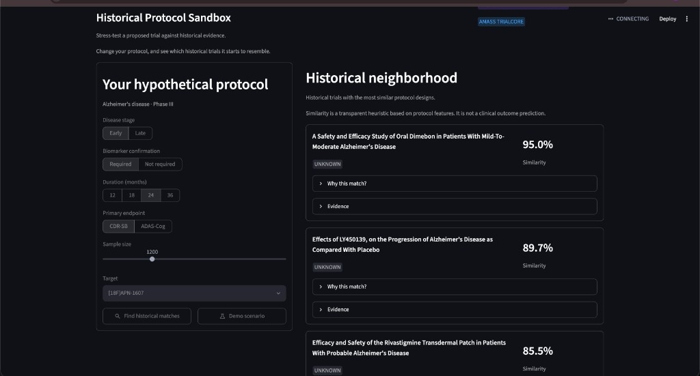
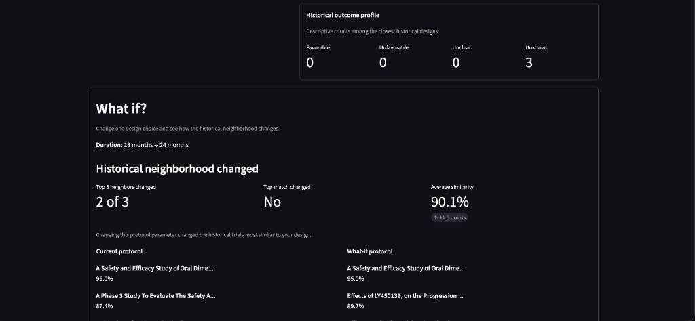
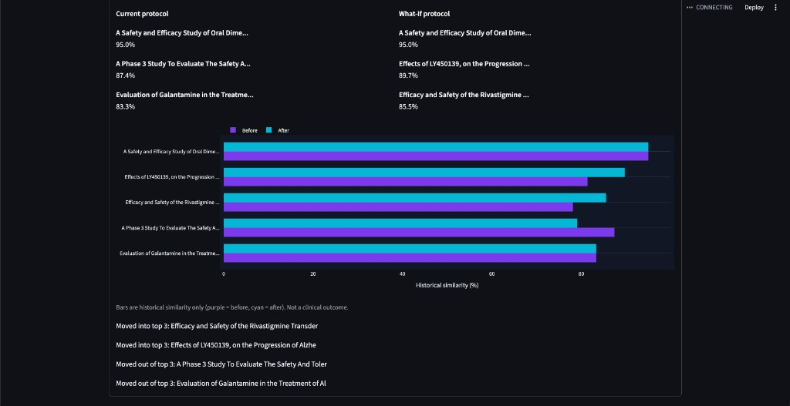
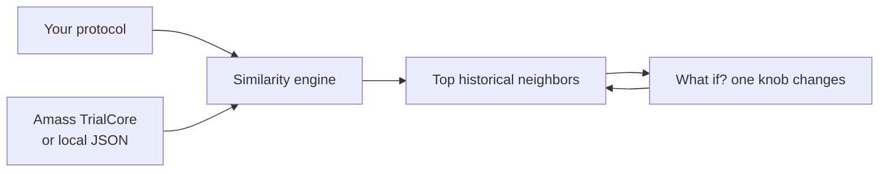

<p align="center">
  
</p>

<h1 align="center">TrialTwin</h1>

<p align="center">
  <strong>Stress-test a proposed Alzheimer's Phase III trial against historical protocols.</strong><br>
  Change one design choice. See which past trials you start to resemble.
</p>

<p align="center">
  
  
  
  
</p>

<p align="center">
  Built in one afternoon at the <em>AI in Life Sciences</em> hackathon<br>
  DTU Skylab × Cursor × Amass · September 2026
</p>

<p align="center">
  <a href="https://share.streamlit.io/deploy?repository=amedeone03/amass-trialcore-demo&branch=main&mainModule=app.py">
    
  </a>
</p>

---

## Working demo

**One-click (Streamlit Community Cloud):** [Deploy this repo](https://share.streamlit.io/deploy?repository=amedeone03/amass-trialcore-demo&branch=main&mainModule=app.py) — sign in with GitHub, keep `app.py` as the entry file, then click **Deploy**. The app runs on the bundled prototype data without an Amass key.

**On your machine:**

```bash
pip install -r requirements.txt
streamlit run app.py
```

Open [http://localhost:8501](http://localhost:8501) → click **Demo scenario**.

That is the demo: a protocol on the left, closest historical twins on the right, then a **What if?** shift when a knob changes.

<p align="center">
  
</p>

<p align="center">
  
</p>

**What the app is saying**

> If you design a trial like this, these past trials look most like it.  
> Change one parameter, and you may now sit next to a different set of historical trials.

It is **not** a success predictor. 95% similarity means design resemblance, not a 95% chance the trial works.

---

## How it works



1. You lock **Alzheimer's disease · Phase III**, then set stage, biomarker, duration, endpoint, N, and target.
2. A transparent heuristic scores every historical trial (exact / similar / different / unknown).
3. You get the closest neighbors and a feature-by-feature **Why this match?**
4. Change one control. **What if?** shows who entered and left the top three.

Scoring lives in `trialtwin/engine.py`. The UI does not invent matches. Missing TrialCore fields stay `unknown` — live data often has no success/failure label, disease stage, or biomarker flag.

---

## Run it yourself

```bash
python -m venv .venv
source .venv/bin/activate
pip install -r requirements.txt
streamlit run app.py
```

| Control | What it does |
| --- | --- |
| **Find historical matches** | Rank live (or fallback) trials against the current knobs |
| **Demo scenario** | One-click neighborhood shift for a pitch or README-style walkthrough |

Optional live data:

```bash
cp .env.example .env   # set AMASS_API_KEY
```

Without a key, TrialTwin still runs on `trialtwin/data/alzheimer_trials.json` (synthetic, labeled for the sandbox only).

```bash
python -m unittest discover -s trialtwin/tests -v
```

---

## Repo

```
app.py                         Streamlit entry
trialtwin/app.py               UI
trialtwin/engine.py            Similarity + what-if
trialtwin/amass_client.py      TrialCore + local fallback
trialtwin/normalize.py         Amass JSON → trial records
trialtwin/data/                Prototype Alzheimer's set
docs/                          Demo screenshots
```

Prototype, not medical software. Built to turn life-science trial data into something that **runs**.
