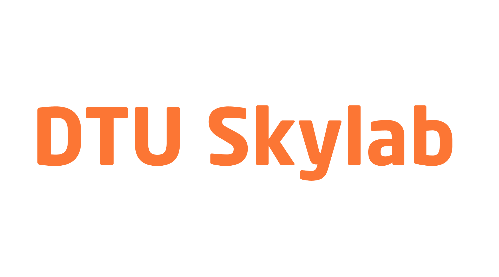
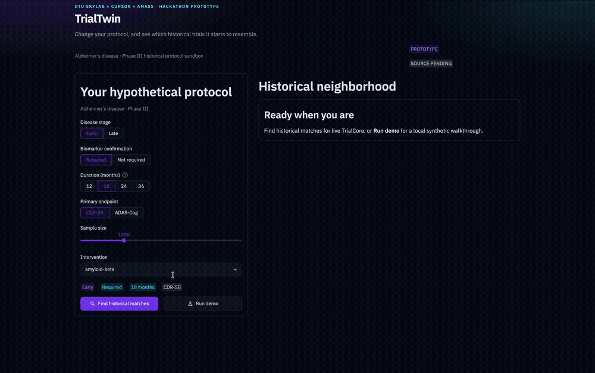

# TrialTwin

### Historical benchmarking for clinical-trial design

🥈 **2nd Place · 16 September 2026**  
**AI in Life Sciences Hackathon · DTU Skylab × Cursor × Amass**  
Copenhagen, Denmark

<table align="center">
  <tr>
    <td align="center" width="180">
      
    </td>
    <td align="center" width="30">×</td>
    <td align="center" width="180">
      
    </td>
    <td align="center" width="30">×</td>
    <td align="center" width="180">
      
    </td>
  </tr>
</table>

> **Change your protocol. See which historical trials it starts to resemble.**

TrialTwin compares a hypothetical clinical-trial protocol with historical designs, explains the closest matches, and shows how the historical neighborhood changes when one design decision changes.

<p align="center">
  <a href="https://amedeone03-amass-trialcore-demo-app-yxl5za.streamlit.app/">
    
  </a>
</p>

<p align="center">
  
</p>

| 🥈 **2nd Place** | ⚡ **Built in one day** | 🧠 **Alzheimer's Phase III** | 🔬 **Historical benchmarking** |
| :---: | :---: | :---: | :---: |

## ⚙️ How it works

| **01 · DESIGN** | **02 · MATCH** | **03 · EXPLAIN** | **04 · WHAT-IF** |
| :---: | :---: | :---: | :---: |
| Define protocol | Rank historical neighbors | Show match drivers | Change one decision & rerank |

Built for **Alzheimer's disease Phase III** protocols using disease stage, biomarker strategy, endpoint, duration, sample size, and intervention.

> Alzheimer's disease and Phase III define the candidate pool; they are not part of the similarity score.

## 📐 Similarity vs coverage

| Metric | Meaning |
| --- | --- |
| **Historical similarity** | Resemblance among comparable historical fields |
| **Comparison coverage** | How much of the intended comparison had usable data |

> **High similarity ≠ high coverage.**

[Scoring methodology →](docs/SCORING.md)

## Under the hood

<p align="center">
  
  
  
</p>

Historical records are normalized, compared, ranked, and explained by the TrialTwin matching pipeline.

> Missing historical fields stay missing — they are not silently imputed into the similarity score.

## 🧪 Data modes

**Live Amass** — retrieved TrialCore records with provenance where available.  
**Run demo** — bundled synthetic records for a deterministic walkthrough.

`Run demo` never calls Amass.

## 🚀 Quick start

```bash
git clone https://github.com/amedeone03/trialtwin.git
cd trialtwin

python3 -m venv .venv
source .venv/bin/activate
# Windows: .venv\Scripts\activate

pip install -r requirements.txt
cp .env.example .env

streamlit run app.py
```

```bash
python -m unittest discover -s trialtwin/tests -v
```

## Team

**Amedeo Bozzoli · Christian Deluca · Marcos Cuervo Santos**

Built in one day at the **AI in Life Sciences Hackathon**, DTU Skylab · 16 September 2026.

## Scope

- Research/hackathon prototype, not clinical decision support.
- Historical similarity is **not** a probability of trial success.
- Live TrialCore fields may be incomplete.
- Candidate retrieval is capped (`TRIALTWIN_CANDIDATE_LIMIT`, default `100`), not exhaustive.

## License

MIT — see [`LICENSE`](LICENSE). Source-code license only; Amass data and third-party services are excluded.
