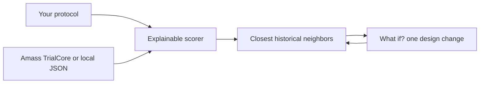

<p align="center">
  
</p>

<h1 align="center">TrialTwin</h1>

<p align="center">
  <strong>A historical protocol sandbox for Alzheimer's Phase III.</strong><br>
  Propose a trial design. See which past trials it resembles.<br>
  Change one knob — watch the neighborhood move.
</p>

<p align="center">
  <a href="https://amedeone03-amass-trialcore-demo-app-yxl5za.streamlit.app/">
    
  </a>
</p>

<p align="center">
  
  
  
</p>

<p align="center">
  <em>AI in Life Sciences</em> · DTU Skylab × Cursor × Amass · September 2026
</p>

---

### What it says

> If you design a trial like this, these past trials look most like it.  
> Change one parameter, and you may now sit next to a different set of historical trials.

Similarity is **resemblance**, not a probability of success. 95% does not mean the trial will work.

---

### What if?

<p align="center">
  
</p>

<p align="center">
  
</p>

---

### How it works



Alzheimer's disease and Phase III stay locked. You set stage, biomarker, duration, endpoint, sample size, and target. Each historical trial is scored feature by feature (exact / similar / different / unknown). **Demo scenario** flips one parameter so the top matches actually move.

Live TrialCore often has no success/failure label, disease stage, or biomarker flag. Those stay `unknown`. The engine never invents clinical facts.

---

### Run locally

```bash
pip install -r requirements.txt
streamlit run app.py
```

Optional: copy `.env.example` to `.env` and set `AMASS_API_KEY`. Without it, the app uses `trialtwin/data/alzheimer_trials.json` (synthetic sandbox labels).

```bash
python -m unittest discover -s trialtwin/tests -v
```

Prototype — not medical software.
