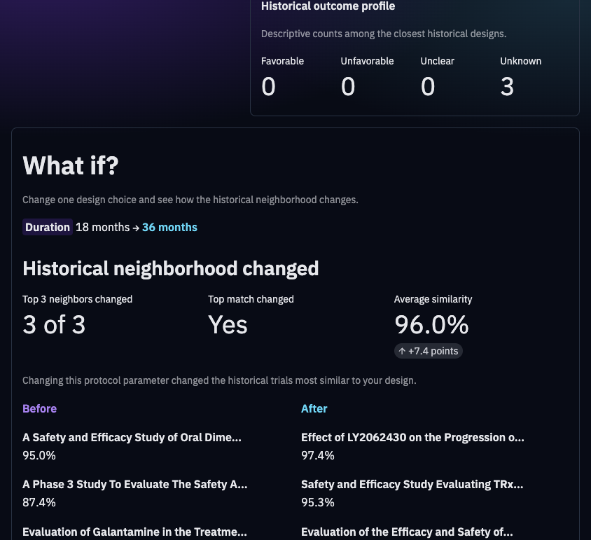
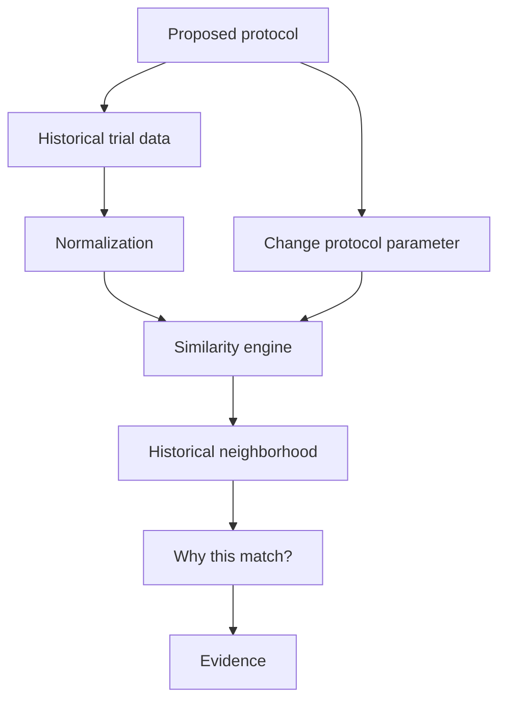
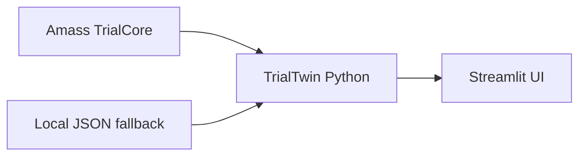

# TrialTwin

### An evidence-driven historical sandbox for clinical-trial design

🥈 **2nd Place** — AI in Life Sciences Hackathon @ DTU Skylab, Copenhagen — September 2026

> Change your protocol, and see which historical trials it starts to resemble.

TrialTwin lets a researcher define a hypothetical Alzheimer's Phase III protocol, compare it with historical studies, understand why specific trials are similar, and explore how the historical neighborhood changes when one design choice is modified. It does not predict success or recommend a protocol.

<p align="center">
  <a href="https://amedeone03-amass-trialcore-demo-app-yxl5za.streamlit.app/">
    
  </a>
</p>

---

## Application screenshot

<p align="center">
  
</p>

<p align="center">
  
</p>

Live app: [TrialTwin on Streamlit](https://amedeone03-amass-trialcore-demo-app-yxl5za.streamlit.app/)

---

## The problem

Clinical-trial design often requires researchers to manually benchmark a proposed protocol against historical studies, comparing characteristics such as patient population, endpoint, duration, biomarker strategy, and sample size.

That process can require searching registries, reading protocols, and assembling comparisons by hand.

TrialTwin turns that historical benchmarking workflow into an interactive sandbox.

---

## How TrialTwin works

1. Design a hypothetical protocol (Alzheimer's disease · Phase III, plus stage, biomarker, duration, endpoint, sample size, target).
2. Retrieve historical trials from Amass TrialCore, or load the local fallback set.
3. Normalize records into comparable fields.
4. Compute protocol similarity (design resemblance only).
5. Rank the closest historical neighbors.
6. Explain why they matched, feature by feature.
7. Modify one protocol parameter.
8. Recompute the neighborhood.
9. Inspect the underlying evidence.



---

## Scientific scope and limitations

TrialTwin is a research/hackathon prototype.

It:

- provides historical protocol similarity
- supports exploratory comparison
- exposes evidence behind matches

It does not:

- predict trial success or failure
- provide medical advice
- recommend trial designs
- establish causal relationships
- replace clinical scientists or statisticians

**The app is saying:** this proposed protocol resembles these historical trials according to the selected design characteristics.

**It is not saying:** those historical outcomes will happen again, or that a feature caused a past trial to succeed.

---

## What does the similarity score mean?

Implemented in `trialtwin/engine.py`. The score is a **historical design resemblance heuristic**. It is not probability of success, probability of failure, clinical risk, treatment efficacy, protocol quality, or causal evidence.

`outcome_class` is **not** an input to the score. It is copied onto the result only so the UI can show a descriptive historical-outcome badge.

### Fields and weights

Weights sum to 1.00:

| Field | Weight | Type |
| --- | ---: | --- |
| Disease stage | 0.20 | Categorical |
| Biomarker strategy | 0.20 | Categorical |
| Disease | 0.15 | Categorical |
| Primary endpoint | 0.15 | Categorical |
| Phase | 0.10 | Categorical |
| Duration (months) | 0.10 | Numeric (scale 18) |
| Sample size | 0.05 | Numeric (scale 2000) |
| Target | 0.05 | Categorical |

Disease and phase are scored like any other categorical field. In this prototype they are locked to Alzheimer's disease and Phase III on the proposed protocol, so they typically match every live TrialCore row in the default search.

### Categorical similarity

Exact match (case-insensitive strings, or equal booleans) → field score 1.  
Mismatch → 0.

Missing, empty, `"unknown"`, or `"ambiguous: …"` on either side → status **unknown**. That field is excluded from the denominator (not treated as a mismatch).

### Numeric similarity

`max(0, 1 − |protocol − historical| / scale)`

Duration scale = 18 months. Sample-size scale = 2000. Exact equality is a full match; a difference at least as large as the scale contributes 0.

### Aggregation

For comparable (non-unknown) fields:

`similarity = Σ (weight_i / Σ comparable weights) × field_score_i`

Unknown weights are dropped, then remaining weights are renormalized. Rank order is similarity descending, then `trial_id` ascending. Historical outcome labels do not enter this formula.

On live TrialCore, stage and biomarker are often unknown, so about 40% of the checklist can drop out. Disease + phase then dominate, which is why live scores can look high even when interventions differ.

---

## What-if exploration

A researcher changes one design choice—for example duration 18 → 36 months, or biomarker Required → Not required.

TrialTwin recalculates similarity and reranks the same historical set.

This does **not** mean the new protocol is better. It means the modified protocol resembles a **different historical evidence neighborhood**.

---

## Example (illustrative)

Proposed protocol:

- Disease: Alzheimer's disease
- Phase: Phase III
- Disease stage: Early
- Biomarker strategy: Required
- Duration: 18 months
- Primary endpoint: CDR-SB
- Sample size: 1,200

Closest neighbors are the top-ranked historical designs for that feature vector (labels and percentages depend on the live TrialCore snapshot or the local mock set). Treat any on-screen titles as **that run's neighborhood**, not as a fixed published result.

Changing one field (for example duration) can move Historical Trial A out of the top three and bring Historical Trial B in. That is neighborhood change, not improvement.

---

## Architecture



| Piece | Role |
| --- | --- |
| Amass TrialCore | Historical clinical-trial records (live retrieval) |
| TrialTwin (`engine`, `normalize`, `models`) | Normalization, similarity, ranking, explanation |
| Streamlit | Interactive application |
| Cursor | Development tool used during the hackathon; not part of runtime |

---

## Data provenance

**Live mode.** When `AMASS_API_KEY` is set and TrialCore responds, records are fetched (`Alzheimer's disease`, `PHASE3`) and normalized. Missing fields stay unknown/`None`. Outcome class is always `unknown` because TrialCore does not provide a success/failure label. Empty live results are **not** replaced with demo rows.

**Local / demo mode.** If live retrieval is not requested or Amass is unavailable, the app loads `trialtwin/data/alzheimer_trials.json`. Those records are **mock/synthetic**: titles and `why_stopped` are marked `[DEMO/MOCK]`. Their `outcome_class` values are sandbox labels only, not real trial results.

---

## Quick start

```bash
git clone https://github.com/amedeone03/amass-trialcore-demo.git
cd amass-trialcore-demo

python3 -m venv .venv
source .venv/bin/activate   # Windows: .venv\Scripts\activate

pip install -r requirements.txt

cp .env.example .env
# AMASS_API_KEY=your_amass_key_here   # optional

streamlit run app.py
```

Open http://localhost:8501. **Find historical matches** uses live TrialCore when the key works; otherwise the mock JSON. **Demo scenario** applies a one-parameter flip so the neighborhood moves.

```bash
python -m unittest discover -s trialtwin/tests -v
```

---

## Project structure

```
app.py                      Streamlit entry (calls trialtwin.app.main)
requirements.txt
.env.example
trialtwin/
  app.py                    UI
  engine.py                 Similarity, ranking, what-if
  models.py                 Protocol and HistoricalTrial
  amass_client.py           TrialCore HTTP + local fallback
  normalize.py              Amass JSON → HistoricalTrial
  data/alzheimer_trials.json
  tests/
docs/assets/                Screenshots
.github/workflows/tests.yml
```

---

## Hackathon

TrialTwin was built during the AI in Life Sciences Hackathon at DTU Skylab in Copenhagen in September 2026. The project placed 2nd.

Built during the AI in Life Sciences Hackathon hosted at DTU Skylab with Cursor and Amass. That does not imply endorsement beyond hosting and tooling.

---

## Team

- Amedeo Bozzoli — [GitHub](https://github.com/amedeone03)
- Christian — TODO (GitHub profile)
- Team member — TODO

---

## Roadmap

- Expand beyond Alzheimer's disease
- Validate similarity features with domain experts
- Improve protocol normalization and evidence traceability
- Evaluate similarity functions empirically
- Support more trial-design dimensions
- Richer historical-outcome display **where values are verified**

Not in scope unless separately validated: predicting clinical success or automatically optimizing protocols.

---

## License

This repository currently has **no explicit license**. Maintainers should choose one before wider reuse.
